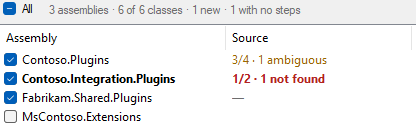
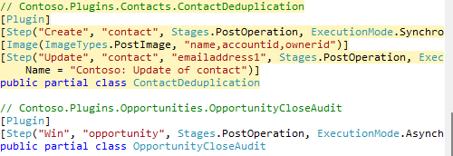

# Changelog

## Unreleased

- **The tool remembers what you ticked and where your source is, and marks whatever
  was not there last time.** Every opening used to start from nothing: load, find your
  assemblies in the list again, tick them again, untick the same two classes again, paste
  the folder again. Now the first **Load Assemblies** of an environment puts all of that
  back, and anything on either list that was not on it the last time you had that
  environment open wears a small green mark - a colleague's new assembly, a class somebody
  registered since - with the count on the status line and the reason in the row's tooltip.

  

  The memory is per environment, so two orgs do not trade ticks, and it is written as you go
  rather than when the tab closes. Only the first load of an environment restores; pressing
  **Load Assemblies** again in the same session still starts over, and **Refresh** still
  keeps what you have. A class counts as new only against an assembly whose classes you had
  looked at before: ticking one for the first time does not mark the whole group.

- **Selecting a class in either list scrolls the preview to its block and tints it.**
  Picking a row under the source folder already found its class on the left; the preview
  was still read from the top down to find what that class would be given. Now the block
  comes up to the top of the pane on a pale yellow, and follows the preview when you tick
  or untick others. A class that is not ticked is not in the preview, so it leaves the pane
  where it is.

  

- **Write to Files no longer leaves a timestamped .bak copy beside every file it changes.**
  Your source control already holds the original, and the write is a diff you can review and
  revert there; the copies were only clutter to sweep up or ignore afterwards.

## 1.2.0

- **A registered class with no steps is no longer filed as unregistered.** A plugin type
  somebody registered and has not written a step for yet is not listed — there is nothing
  to document — so its `.cs` file fell through to **In folder, not registered**, whose
  tooltip said in as many words that nothing registers it. That is the opposite of what
  happened to that class, and it sent you off to register something that was already
  registered. Those files now have a group of their own, and the middle column's status
  line counts them apart from the classes nothing registers at all.

  

- **The assembly list drops its Isolation column and spends the width on saying what is wrong
  with each assembly's source.** That column read
  `Sandbox` down every row you were shown — Dataverse online forces it on everything that is
  not Microsoft's, and the **Microsoft's** switch hides the rows where it does not — so a
  quarter of the pane was spent saying the same word. It is gone, an assembly registered in
  full trust says so in its tooltip, and the Source column got the width. What it spends it
  on is the thing the roll-up would not say: `3/4 ✗` told you how bad it was without telling
  you which, and *no file* and *declared in two files* are two different afternoons.

  

  Its three empty states — not ticked yet, no source folder chosen, nothing registered in the
  assembly — also answer when hovered, and the last of them reads `—` as soon as the row is
  ticked rather than staying blank until a folder is chosen.

- **Stale files have a group of their own, so "what have I got to rewrite" is one look rather
  than a scan.** They sat inside **Matched**, marked with a word
  on the row, which is no way to answer "what have I got to rewrite" — the one question in
  that pane you can act on with a single press.

  

- **The tool behaves itself on a slow link: eight ways a fetch still in flight could mislead
  you or lose your work are fixed.** XrmToolBox draws a small panel in the middle of
  a tool while it waits on the environment — not a sheet over the whole tab — so every button
  stayed live for however long the fetch took. On a fast connection that window is
  milliseconds wide. On a slow one it is where most of a session is spent, and eight things
  went wrong in it:

  - **Closing the tab mid-fetch could take the tab down with it.** The answer still arrived,
    and was handed to a control that no longer existed. Every fetch now checks before it
    draws, the way the folder scan always has.
  - **A late answer could overwrite a newer one — for good.** Press **Refresh** while a fetch
    is still out and two answers to two different questions are in the air; whichever landed
    last was believed, and because the assembly was then in the cache it was never asked
    about again. Fetches now carry the question they belong to and are dropped if it has
    moved on.
  - **Ticking assemblies one at a time re-asked for the ones already on their way.** Five
    ticks put the first assembly on the wire five times. There is now one question out at a
    time, and whatever is ticked meanwhile goes out together when it lands — one round trip
    for the batch instead of one per tick.
  - **Load Assemblies and Write to Files are dead while their own work runs.** Pressing Load
    again cost a second full query whose answer cleared everything ticked since the first;
    pressing Write twice put two writers over the same files, where the backup name is only
    accurate to the second, so the two `.bak` copies collided and the pristine original was
    the copy that got lost.
  - **Write waits for the environment.** It was offered while an assembly was still loading,
    and would write a half-loaded list with a report that read like a complete one.
  - **The status lines stop claiming what has not arrived.** `2 assemblies · 4 of 4 classes`
    is a complete-sounding sentence about a list with an assembly missing from it, and every
    class of that assembly was filed, in words, under **In folder, not registered** — then
    quietly un-filed when the network caught up. The count now says what it is waiting on,
    the assembly's own row shows `…`, and nothing is called unregistered until every
    registration is in.

    

    

  - **A fetch can be abandoned.** The progress panel now offers Cancel. A query already on
    the wire cannot be recalled, but the three round trips behind it can be called off, which
    is most of the wait on the link where it matters. Nothing is recorded, so unticking and
    ticking again asks afresh.
  - **A fetch that fails says so where you can still read it.** The dialog is dismissed and
    then there is only the list, and an environment that could not be reached looked exactly
    like an environment with nothing in it. The status line keeps the reason.

  `tests\slow.ps1` is what found all of it: ten scenarios driving the real control against
  a Dataverse that takes seconds to answer, with a screenshot per gesture.

- **The source folder can be slow too, and no longer freezes the window when it is.** A plugin
  repository is as likely to be on a UNC share, a mapped drive or a sync client that has
  stopped syncing as it is to be on a disk, and against one of those simply asking whether a
  folder exists blocks until the network gives up. That question was being asked from the
  button-state pass, which runs **on every keystroke in the folder box** — so typing the path
  to a share that was down froze the tool once per character. It is now asked once, on a
  worker, after the same half-second pause the scan already waits out, and everything else
  reads the answer it left. The box says `Looking for that folder...` while the question is
  out, rather than calling the path wrong before anybody has looked.

  **Create Attribute Definitions File** was the last thing still writing on the UI thread —
  both looking for the file and writing it. It runs on a worker like every other write.

- **The source folder is read once, not once per class, so a 250-file project scans in 17 ms
  rather than four seconds.** A project of 250 files with 33
  registered classes took four seconds to scan and six to write. Reading all 250 files takes
  twelve milliseconds, so none of that was ever the disk: every registered class was
  re-scanning every file's text with a regex of its own, working out which local classes are
  plugins built a fresh `Regex` for every name-against-class pair and did it again on every
  pass, and one press of **Write to Files** walked and re-read the whole folder once per
  class. The folder is now read and parsed once and answered out of a dictionary.

  | On 250 files, 33 classes | Was | Now |
  |---|---|---|
  | Scan | 4051 ms | 17 ms |
  | Write | 6306 ms | 48 ms |

  A 4000 file repository — larger than most plugin repositories get — now scans in about
  600 ms, of which 430 ms is reading the files.

- **Write no longer freezes the window: it runs under the same progress overlay that loading
  the assemblies does.** It ran on the UI thread, so a slow write was a
  tool that had stopped repainting. It runs under the same progress overlay as loading the
  assemblies does, and says how many classes it is writing.

- **Marks from another folder are cleared when you change folders**, rather than sitting
  there looking authoritative until the new scan lands. A rescan of the *same* folder — the
  one that follows a write — keeps its marks up, because blanking the column on the way back
  from a successful write reads as a fault.

- `tests\perf.ps1` times the scan and the write over generated repositories of 250 to 4000
  files, against what reading the folder once costs on the same machine. It is what found
  all of the above.

- **The summary comment is grouped by table, so a plugin registered against a dozen tables
  reads as a dozen short lists.** A generic plugin — one class registered
  against a dozen tables to stamp the same column on all of them — used to read as one
  interleaved list, every table's steps scattered through it by stage. The comment now
  takes a table at a time, tables alphabetically, keeping the order each table's own steps
  run in; a step on a global message goes last.

  ```csharp
  /// Sync Post-Create of account (order 1): (all columns)
  /// Sync Post-Update of account (order 1): (all columns)
  /// Sync Pre-Update of annotation (order 1): (all columns)
  /// Sync Post-Create of annotation (order 1): (all columns)
  ```

  **The attributes are unchanged** and stay in execution order: that is the order Xrm Tools
  reads them back in. The one thing that did change there is a tiebreak — steps tying on
  stage, rank *and* message name are now ordered by table rather than by whatever the query
  returned, so the same registration writes the same file twice running.

- **The docs, the store listing and the generated definitions file now name
  [Xrm Tools](https://github.com/rezanid/xrmtools) as whose attribute model this is.** It is
  the Visual Studio extension that reads
  these same attributes back to deploy and register an assembly — and that is worth
  installing whether or not you use this. Compatibility with it is this tool's premise; it
  had earned more than a passing link.
- `XrmToolsMetaAttributes.cs` gains `Stages.DepecratedPostOperation = 50` — upstream's
  spelling, upstream's `[Obsolete]` — which it had been missing. Nothing the tool writes
  changes: a step at the retired stage 50 is still emitted as `(Stages)50`, because naming
  that member is a compile error against the real package too.
- The emitted attributes are now checked against the real `XrmTools.Meta.Attributes`
  package rather than only against our copy of it. `tests\compat.ps1` compiles a corpus
  covering every emitter decision against both, at four package versions, and compares the
  constructed attributes property by property.

- **Nothing that goes wrong should reach XrmToolBox's crash dialog.** Everything the tool
  does on a worker already reported itself — a failed query, a locked file, a folder that
  cannot be read — but the same work on the UI thread had no net under it at all, so one
  unlucky registration could take the tab down while drawing a list. Composing the output
  for a class is now guarded everywhere it happens: in the preview the class says so in its
  own place and the rest of the list still renders, in the source column it reads as stale,
  and on **Write to Files** it lands in the report's Failed section by name, beside the
  files that could not be written. A settings file XrmToolBox cannot read or write no
  longer costs the tab either — that read happens before any of the UI exists, so a throw
  there was a tool that would not open and gave no reason. And a folder nested past what
  Windows will open — which a package cache manages without trying — is stepped over the
  way an unreadable one already was, rather than failing the whole scan.

## 1.1.0

- **An image or filter covering nearly all of a table's columns can say "all columns except"
  instead of reciting seventy names** (experimental, off by default). It reads `(all columns except: creditlimit,
  ilac_legacyid)` instead of reciting seventy names. A list that covers every column reads
  `(all 75 columns, written out)`; a stale column name is left verbatim so it stays visible.
- **Experimental settings live behind a new † button in the write toolbar, and are remembered
  across sessions.**

  

- **A third column scans your source folder in the background and marks every class current,
  stale, missing or ambiguous.** The folder picker moved into it — ✓, ✎, ✗, ⚠ —
  with per-assembly roll-ups and cross-highlighting between the lists.
- **Write to both files when a class is declared twice, so a partial class is documented on
  both halves** (optional): every file declaring the class gets the same block.
- **The code preview collapses, giving its width to the source column.**
- **Refresh rereads the assemblies and steps without losing your ticks, filter or folder.**
- **A short-name tie between two files is settled by the registered namespace, so same-named
  classes stop coming back ambiguous.**
- The hint above the buttons now says what a write would do
  (`Will write 5 classes · 2 skipped (1 no file, 1 ambiguous)`).

## 1.0.0

First release.

- **Reads the plugin steps and images registered in the connected environment and writes them
  into your C# source.** As [Xrm Tools](https://github.com/rezanid/xrmtools) `[Plugin]`,
  `[Step]` and `[Image]` attributes, or as a readable summary comment.
- **The assembly list defaults to the unmanaged assemblies; Microsoft's and Managed are
  switches carrying the count of what they hold back.**
- **Writes above the class declaration, replacing only its own block; every changed file gets
  a timestamped `.bak` beside it.**
- **Create Attribute Definitions File emits a dependency-free `XrmToolsMetaAttributes.cs`, so
  the attributes compile with no package at all.**
- **Read-only: nothing is ever written back to the environment.**

Requires XrmToolBox 1.2025.7 or later.
